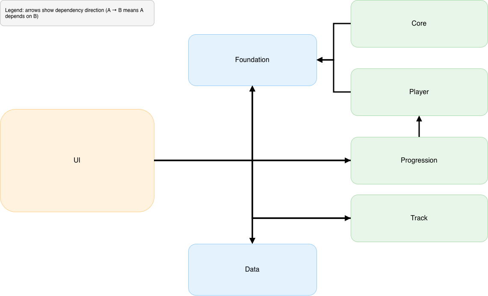
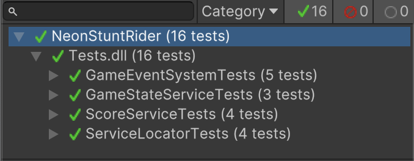

# Rider – Prototype

A modular Unity prototype inspired by *Rider*. Focus: clean architecture, dependency control, and feature presentation across small stages.

## Project summary
This is a **prototype** derived from a *Stunt Bike Racing* experience, split into independent stages to showcase specific features while keeping systems decoupled.

## Status
- Built in Unity (version-agnostic; use your installed LTS if possible)
- No localization package yet
- No music or sound yet

## Basic
- Bike Physics
- Track Splicing

## Game mechanics
- Hold to accelerate
- Hold to flip in the air
- Distance score

## Features
- Finish Line
- Head Crash
- Spike Crash
- Boost Platform
- Collectible Diamond
- Bonus Treasure
- Flip Count Score Bonus

## Architecture overview

### Folder responsibilities
- **Foundation**: Interfaces, constants, event system, service locator, core service implementations
- **Core**: GameBootstrap, GameCoordinator, CameraService
- **Data**: ScriptableObjects (LevelData, TrackData)
- **Player**: BikeController, CrashDetector
- **Progression**: LevelService (scene-based), TrackService (prefab-based), ShowcaseLevelManager
- **Track**: Collectible, CollectibleService, BonusLetter, BonusLetterService, BoostPlatform, Spike, FinishLine
- **UI**: ScoreUI, FlipMessageUI, LevelResultUI, BonusLetterUI, TreasureChestPanel, ShowcaseLevelUI

## Repository tour
- `/Assets/Scripts/Foundation` — contracts, DI, events, core services
- `/Assets/Scripts/Core` — bootstrap, coordinator, camera
- `/Assets/Scripts/Data` — level and track data assets
- `/Assets/Scripts/Player` — player control and crash detection
- `/Assets/Scripts/Progression` — scene or prefab track flow
- `/Assets/Scripts/Track` — interactables, hazards, goals, collectibles
- `/Assets/Scripts/UI` — presentation and feedback

## Stages
Seven small stages demonstrate the features above. Each stage isolates a mechanic or interaction for quick review and tuning.

## How to run
1. Clone the repo and open the project in Unity.
2. Open SampleScene.
3. Press Play.  
   - Hold to accelerate  
   - Hold in air to flip  
   - Reach Finish Line or trigger hazards to see flow

## Tests

